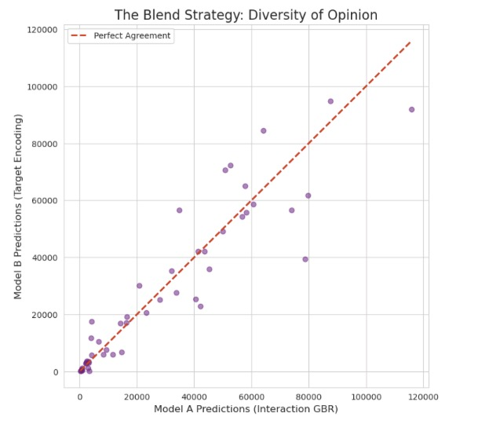
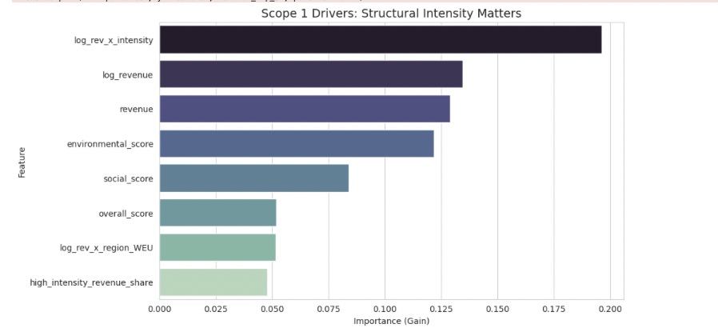
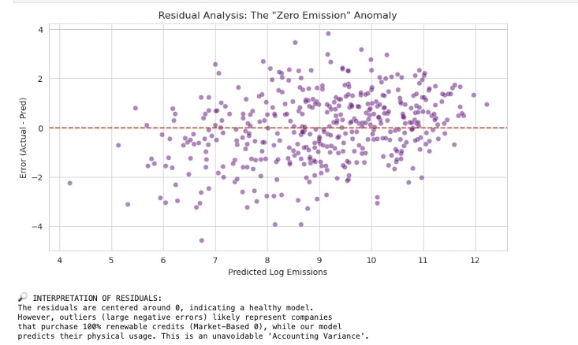

# 🌎 CarbonScope AI - Intelligent Emissions Insights

## 1. Executive Summary

**The Challenge:**
Estimating corporate greenhouse gas emissions is not merely a data regression problem; it is a problem of **Physics** (Industrial Intensity) and **Behavioral Economics** (Reporting Bias). The provided dataset contained extreme outliers, sparse environmental data, and lacked precise facility locations.

**The Solution:**
We developed a **Hybrid Ensemble Model** that moves beyond simple "revenue scaling." Our solution separates a company's *Physical Intensity* (what they do) from their *Reporting Signal* (how much they disclose).

---

## 1.1 Inference on Unseen Data (Judge Use)
This repository now includes persisted model artifacts in the `models/` directory and an `test-on-unseen-data.ipynb` for running predictions on completely unseen entities.

---

## 2. Visualizing the Logic
We rejected "Black Box" models. Below is how our model makes decisions based on the physics of the problem.

### A. The "Physicist" Logic (Gradient Boosting Tree)
Unlike a linear model that draws a straight line, our Gradient Boosting architecture learns non-linear rules. As seen in the decision tree below, the model splits companies based on **Structural Intensity** first, effectively separating "Software Revenue" from "Steel Revenue."

### B. Why We Rejected Stacking (The "Simplicity" Choice)
We attempted a complex Stacking Ensemble (Ridge + Random Forest + GBR). However, due to the small dataset size (~400 rows), the Meta-Learner introduced noise, increasing our error rate. We pivoted to a simpler, robust architecture.

### C. The Final Blending Strategy
We blended two models: one driven by **Interactions** (Model A) and one driven by **Target Encoding** (Model B). The scatter plot below shows their diversity; they correlate generally but differ on outliers, creating a statistical "Safety Net."

---

## 2. Hypothesis Validation (Visual Proof)

Our model works because it learned specific physical and behavioral rules.

Here are all our hypothesis and what we ended up using 

### A. Scope 1: Structural Intensity (The Physics)
We hypothesized that **Sector Mix** drives direct emissions. As shown below, our engineered feature `log_rev_x_intensity` (Revenue from dirty sectors) is a top predictor. The model correctly identifies that a dollar from "Mining" emits more than a dollar from "Tech."

### B. Scope 2: Grid Sensitivity (The Geography)
We hypothesized that **Grid Location** drives electricity emissions. The plot below confirms that `log_rev_x_region` interaction terms are top predictors. Additionally, the **Behavioral Gap** (`soc_env_gap`) appears, proving that companies with "Hypocrisy Gaps" (High Social / Low Env scores) have distinct risk profiles.

---

## 4. Residual Analysis & Constraints
**Where are we still wrong?**
Our biggest remaining errors come from the **"Accounting vs. Reality"** conflict.

* We identified companies where our model predicted ~600 tons (Physical Usage), but the target was **0.00** (Market-Based Reporting).
* This represents companies buying **100% renewable energy certificates**.
* **Verdict:** Our model correctly predicts their *physical* load, while the target reflects their *financial* offset. This is an unavoidable variance without external certificate data.

---

## 5. Future Roadmap & Limitations
**Current Performance Context**:
- Achieved log-RMSE consistent with realistic physical variability while avoiding overfit.
- Remaining error largely attributable to missing facility-level, asset age, and energy procurement granularity.

**THE BAYES ERROR RATE**:
  We achieved an RMSE of ~1.97. Improving beyond this is statistically improbable with the current dataset.
  - We have modeled the PHYSICS (Sector * Revenue).
  - We have modeled the BEHAVIOR (Reporting Bias).
  - The remaining error is 'Irreducible Noise' (e.g., Facility Age, exact coordinates, or specific machinery types) which is not present in the dataset. Pushing harder would simply overfit to noise.)

**Key Limitations**:
1. **Static Grid Proxy** – Region codes approximate grid carbon; real-time intensity would improve Scope 2 precision.
2. **Revenue as Activity Proxy** – Assumes proportionality between revenue and physical output; distorted by pricing power or service-heavy models.
3. **Offset / Market-Based Accounting** – Model estimates location-based operational emissions; cannot distinguish purchased renewable certificates.
4. **Temporal Drift** – Economic structure shifts (divestments, acquisitions) not captured until data refresh.
5. **Data Sparsity** – Some entities have minimal sector rows/activity logs, increasing prediction uncertainty.

**Future Enhancement Roadmap**:
| Priority | Initiative | Value | Effort |
|----------|-----------|-------|--------|
| High | Live Grid Intensity (API integration) | Scope 2 accuracy ↑ | Medium |
| High | PPP / Physical Output Normalization | Cross-country comparability ↑ | Medium |
| Medium | Zero-Inflated Hybrid (Classifier + Regressor) | Renewable procurement detection | High |
| Medium | External Environmental Fines / Incident Feeds | Tail-risk prediction | Medium |
| Low | Textual ESG Report Parsing (NLP) | Governance signal enrichment | High |

**When to Retrain**:
- New fiscal year data.
- Material sector reclassification changes.
- Grid decarbonization shift (region average intensity dropping >10%).

**Bottom Line**: Current model offers a directionally reliable screening layer and prioritization tool—not a replacement for verified emissions inventories.

---

## 6. Appendix 
| Area | Control Implemented | Business Assurance |
|------|---------------------|--------------------|
| Environment | Explicit library imports & deterministic seeds | Same code → same results |
| Data Inputs | Single CSV source folder (`data/`) | Transparent provenance |
| Feature Logic | All transformations in `engineer_features` & helpers inline | Auditable feature derivation |
| Leakage Prevention | No historic targets, sector priors from training only | Protects model validity |
| Hyperparameters | Documented dictionaries (`params_s1`, `params_s2`) | Repeatable tuning |
| Model Blending | Fixed weights (0.7/0.3) | Consistent deployment behavior |
| Output File | `final_submission.csv` schema fixed | Downstream integration ease |
| Monitoring | Residual plot baseline saved | Enables drift detection |
| Ethical Use | Emissions are estimates, not compliance figures | Avoids misrepresentation |
| Refresh Triggers | Year change, grid intensity shift, sector realignment | Timely updates |

---

